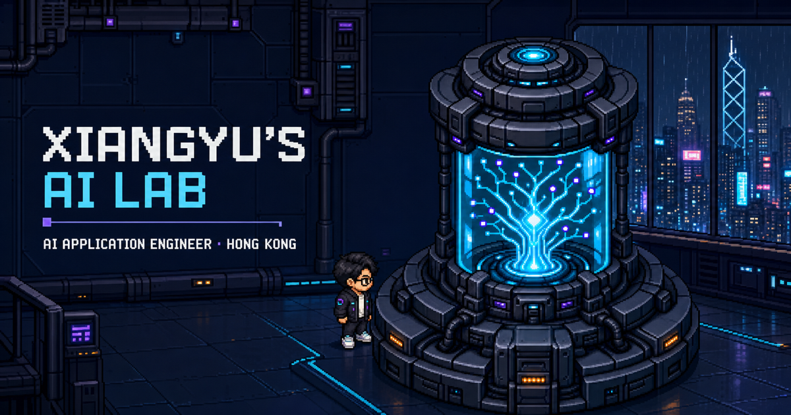

# Xiangyu’s AI Lab

An explorable pixel-art portfolio about AI application engineering, interactive systems, and building production software in Hong Kong.



## About the project

Xiangyu’s AI Lab turns a personal portfolio into one small, walkable research room. Visitors can explore five stations with a character or use the always-available Archive Index to reach the same content directly.

This is a focused interactive website, not a full RPG. Atmosphere creates curiosity; readable project details, accessible navigation, and direct contact routes remain the foundation.

Current release: **v0.5 — complete**.

## Highlights

- One 960 × 540 pixel-art laboratory set against a rainy future Hong Kong skyline
- Free four-direction movement with collision and station interaction
- Five formal stations: Lab Companion, Experience Archive, Living AI Core, Selected Work, and Future Gate
- Quick Access and semantic React panels that do not require playing the room
- Content-first mobile layout without a low-quality virtual joystick
- Opt-in procedural ambience with rain, machine hum, and sparse system signals
- Two restrained discovery details connecting the Hong Kong window, Living AI Core, and RAG Pipeline
- Loading-driven cinematic desktop boot sequence with skip and reduced-motion support
- Tiled-owned spatial data with tested spawn, collision, and station contracts

## Work represented

The public Selected Work area currently references two professional directions:

- An interactive TON ecosystem Web3 game built with React, TypeScript, and Phaser
- An anonymized government-facing Legal AI application focused on streaming responses, citations, document workflows, and production frontend infrastructure

Sensitive project names, client identities, internal documents, data, and private interfaces are intentionally excluded.

## Technology

- React 19 and TypeScript
- Phaser 3 with Arcade Physics
- Vite 8
- Tiled JSON/TMJ map data
- Web Audio API
- Vitest and ESLint

React owns readable content, navigation, accessibility, contact, and sound preferences. Phaser owns movement, collision, proximity, and room visuals. A small typed event bridge connects the two layers.

## Run locally

Requires Node.js 24.

```bash
nvm use
npm ci
npm run dev
```

Quality checks:

```bash
npm run typecheck
npm run lint
npm test
npm run build
```

## Controls

- Move: `WASD` or arrow keys
- Interact: `E` or `Space`
- Collision debug: `F2`
- Close panels / skip intro: `Escape`
- Sound: use the `Ambience` / `SND` control; first visit is always muted

On screens below 900 px, use the Archive Index and Quick Access instead of character controls.

## Project documentation

- [Development roadmap](docs/development-roadmap.md)
- [Pixel-art production specification](docs/pixel-art-spec.md)
- [Tiled map contract](docs/tiled-map-schema.md)
- [Asset provenance ledger](docs/asset-ledger.md)
- [Room ambience contract](docs/room-ambience.md)
- [AI Companion LLM decision](docs/ai-companion-decision.md)

Generated source art is kept under `design/sources/`; optimized runtime assets live under `public/assets/`. The asset ledger records production methods and confirms where project-owned references were used.

## Contact

- Email: [zerolxy612@gmail.com](mailto:zerolxy612@gmail.com)
- GitHub: [@zerolxy612](https://github.com/zerolxy612)
